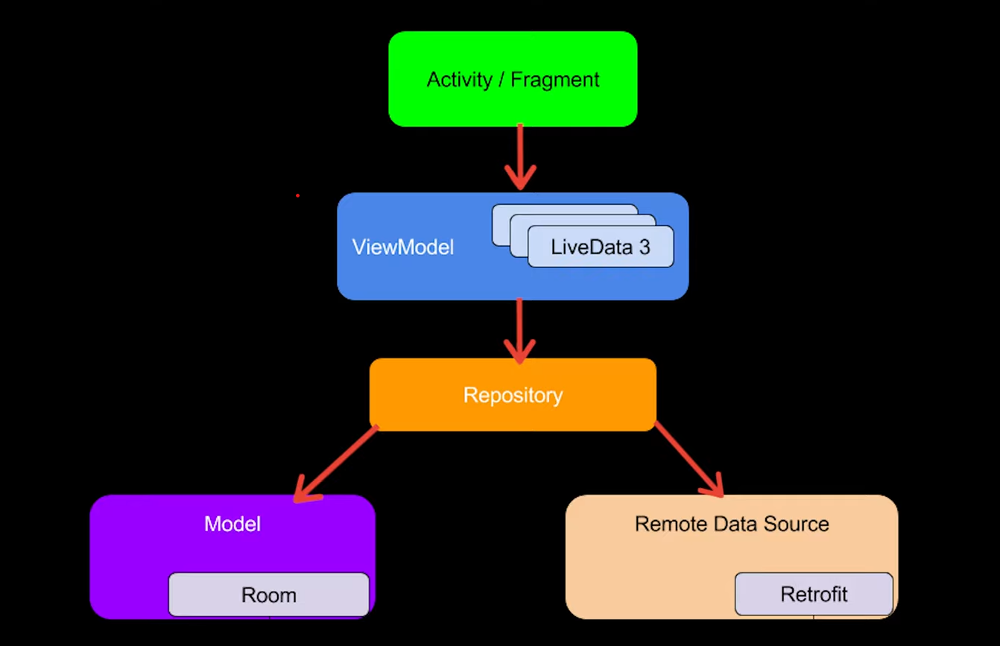

# RealWorld Android App

    

**Author:** [Shivdatt Jangam](https://www.linkedin.com/in/shivdatt-jangam-96b814254/)

# Features

- **MVVM Architectural Design Pattern**: Utilizes the Model-View-ViewModel architecture for clean separation of concerns and easier testing.
- **Kotlin Coroutines**: Utilizes Kotlin's powerful coroutine framework for asynchronous and non-blocking programming.
- **API Integration with Retrofit**: Integrated with RealWorld API using Retrofit and Moshi.
- **API Testing**: Used Junit testing API calls.
- **Article App like Medium**: Offers a user-friendly interface similar to Medium for reading and discovering articles.
- **Clean UI**: Features a sleek and intuitive user interface design for a seamless browsing experience.

# Model

    

## Contributors

- **Shivdatt Jangam**: [GitHub](https://github.com/shivGam)
- Special thanks to Arnav Gupta
